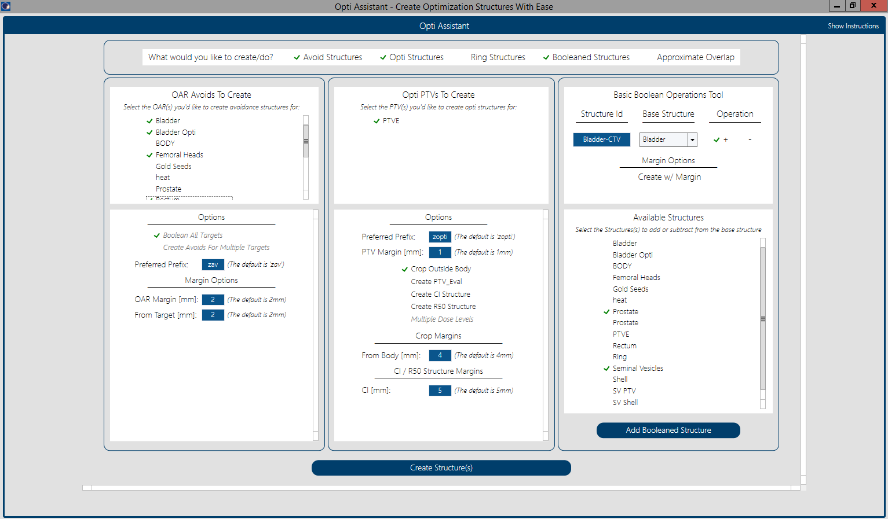

# ESAPI-Projects

Various projects / class libraries I've written for use with the eclipse scripting api provided by Varian

Most recent updates:
- OptiAssistant (as of 7/22/2020 commit):
  - Updates included: 
    - ux design (see image below)
    - improved options for avoidance structures
    - addition of booleaned structure creation
    - approximation of overlap
    - handling for high resolution structures

